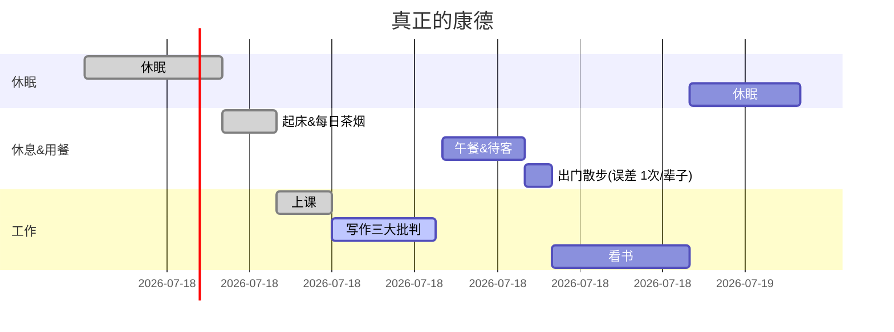
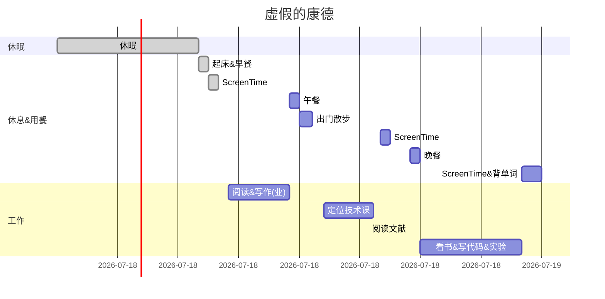

### 康德作息模拟器

```mermaid
   gantt
        dateFormat  HH:mm
    title 真正的康德

    section 休眠
    休眠:done, des1, 00:01,05:00
    休眠:p1, 22:00,4h

    section 休息&用餐
    起床&每日茶烟:done, 05:00,07:00
    午餐&待客:13:00,16:00
    出门散步(误差 1次/辈子):b1,16:00,17:00 

    section 工作
    上课:done,a1, 07:00,09:00
    写作三大批判:active, a2,09:00,12:45
    看书:17:00, 5h
```

```mermaid
   gantt
        dateFormat  HH:mm
    title 虚假的康德

    section 休眠
    休眠:done, des1, 00:01,07:00

    section 休息&用餐
    起床&早餐:done, 07:00,07:30
    ScreenTime:done,07:30,08:00
    午餐:11:30,12:00
    出门散步:12:00,12:40
    ScreenTime:16:00,16:30
    晚餐:17:30,18:00
    ScreenTime&背单词:after w4, 1h

    section 工作
    阅读&写作(业):08:30,11:30
    定位技术课:a1, 13:13,15:40
    阅读文献:16:40,15:25
    看书&写代码&实验:w4,18:00, 5h
    
```